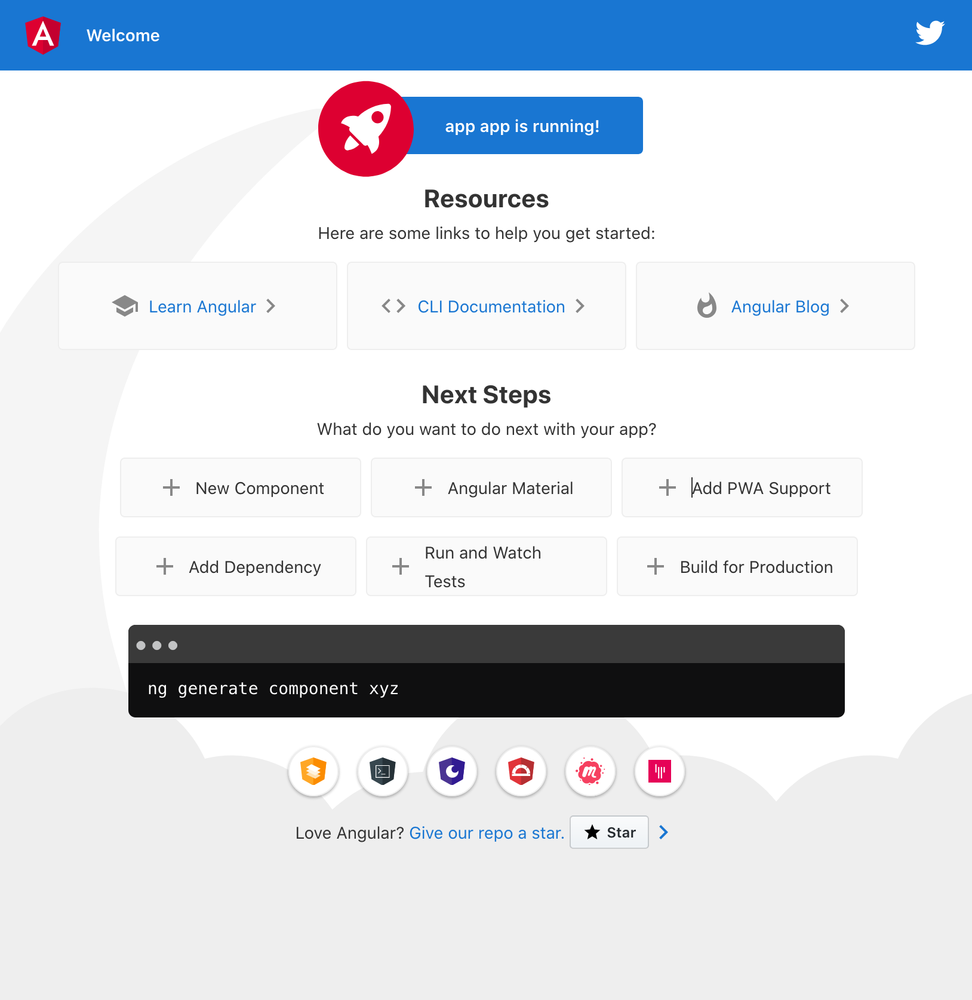
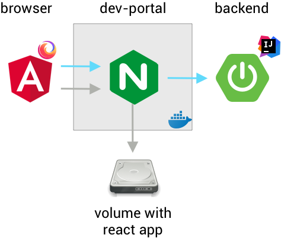
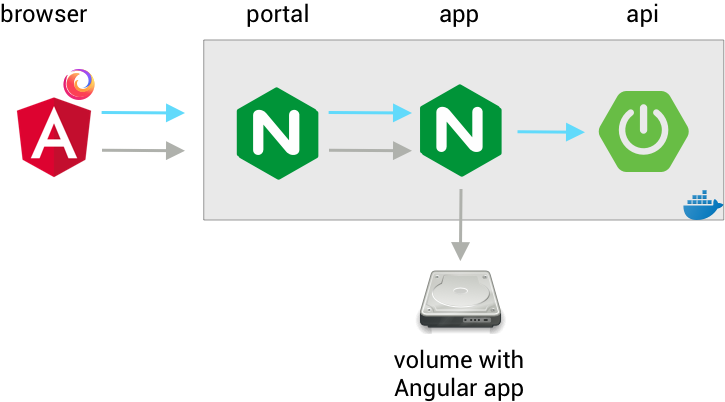
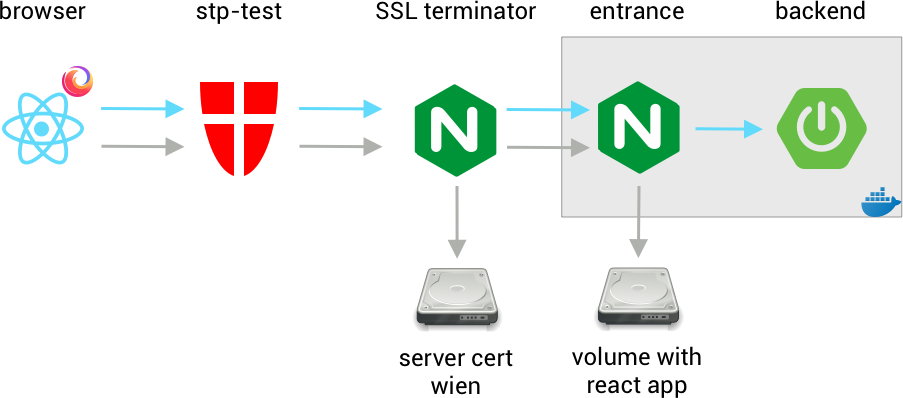

# Starter project for Spring Boot and Angular with Docker Smart CI

This project is a [Spring
Boot](https://spring.io/projects/spring-boot) backend
application with [Angular](https://angular.io/) frontend. The application's
API is documented as an OpenAPI v3 specification.

## Creating a new repository from this starter

* Read the docs of [Docker Smart CI](https://stp-test.wien.gv.at/docker-smart-ci/)

* Create the new repository (e.g. `my-new-app`) in Bitbucket. Leave it empty, don't 
  add a README. You should see instructions titled _Let's put some bits in your bucket_.
  Keep it open, but don't do it now

* Check out [this starter](https://bitbucket.org/ma14pace/springboot-angular-starter/) 
  with `git clone https://bitbucket.org/ma14pace/springboot-angular-starter.git my-new-app`
  under the new name (here: `my-new-app`)

* Change into that new directory

* Remove the old remote: `git remote remove origin`

* Add the new remote: `git remote add origin https://bitbucket.org/ma14pace/my-new-app.git`,
  replacing `my-new-app` with the name of your project

* Add another remote to a development repo (optional)

* Push to the new repository: `git push -u origin master`

## URL structure

We run our applications behind our [Standard
Portal](https://stp-test.wien.gv.at/docker-smart-ci/071_standard_portal.html),
and that requires applications to run with an application-specific
URL prefix.

For this type of project, we recommend a prefix named like the
project (we call that the _portal application name_), followed by a
_portal application role_ for the app. See the details in [the
docs](https://stp-test.wien.gv.at/docker-smart-ci/071_standard_portal.html).

As an example, here are the server-absolute paths of the relevant URLs
for the current project, if we choose `my-new-app` as portal application name:

PATH                                       | PURPOSE
-------------------------------------------|--------
/my-new-app/app/                           | serves the SPA's index.html
/my-new-app/app/api/                       | serves the backend API
/my-new-app/app/api/swagger-ui/index.html  | serves the API documentation

`my-new-app` is the application name, `app` is a role. There is a
second role for viewing logs, it is aptly named `logs`. It is only
available on Docker Smart CI test servers. It's automatically
available without developer intervention.

As detailed in the docs, the application name selects the target
server (per portal zone), while the authorization is associated with
the portal role (i.e. the second part of the path, here `app`). 

In this type of project, we prefer to let the webserver serving the
app, also serve the API. As a consequence, if a user is
authenticated and authorized for the role `app`, the user is
automatically authorized for the API as well.

A single page application (SPA) is served as a bundle of static
files (HTML index page, Javascript, CSS and static assets like
images). While loading the `index.html`, an unauthenticated user
will be redirected to the portal login page. After login, the user
is redirected back the the index page. Once the Javascript begins
accessing the API, the calls are made in the context of the already
authenticated browser.

You can't access the API without being authorized to access the app.
This is perfectly fine, because the API is an integral part of the
app.

If there are additional API functions, that should not be available
to the app and their users, the additional API will have to be
exposed as a separate service with a separate role (for instance
`admin-api`) and separate authorization.

## Before you start coding

Springboot, the generation of the OpenAPI docs and Angular are all
problematic when run behind a reverse proxy like Standard Portal. In
order to attack these problems, the portal application name has to
be coded into some files.

We assume the following:

1. The project's git repo has the same name as the portal
   application
1. The repo has been checked out under its default name, which 
   is also the portal application name

Now, before doing anything else,

1. Change into the root of the checked out repo
1. Run `./portal/bin/init_portal_application.sh [<app-name>]` (e.g. `my-new-app`)

The application name is optional, it defaults to the the name of
the project directory. The output will be something like this:

```
❯ ./portal/bin/init_portal_application.sh

Derived portal application name 'my-new-app' from project directory

Templating files:
* set base URL for Angular app (app/src/index.html)
* set backend proxy for Angular development server (app/backend-proxy.conf.json)
* patch 'ng serve --base-href=' for live serving (app/package.json)
* create backend's application.yml (api/src/main/resources/application.yml)
* create docker-compose.yml
* create a config file for portal simulation in docker-compose-dev.yml (portal/default.conf)
* create header include file for the portal simulations (portal/headers.conf)
❯
```

This command generates a few files

ORIGINAL FILE                                              | GENERATED FILE                             | CAN EDIT GENERATED
-----------------------------------------------------------|--------------------------------------------|-------------------
app/src/index.template.html                                | app/src/index.html                         | -
app/backend-proxy.conf-template.json                       | app/backend-proxy.conf.json                | -
app/package.json                                           | app/package.json                           | X
api/src/main/resources/application_template.yml            | api/src/main/resources/application.yml     | -
docker-compose-template.yml                                | docker-compose.yml                         | -
portal/bin/init_portal_application.sh (embedded in script) | portal/default.conf                        | -
portal/bin/init_portal_application.sh (embedded in script) | portal/headers.conf                        | -

Without the generated files, the application can't be built. So this is a prerequisite.

`./portal/bin/init_portal_application.sh` is also started on the CI server. Therefore:

Never edit one of the generated files (apart from `package.json`). The changes would not be visible
in production! Always edit the **original file** instead.

## Before you modify the application 

This application does a few things, and it is very
useful to understand what they are and how they are
accomplished. It is recommended to not immediately
modify the application, but first to understand it
in its current form. Think of this as a tutorial.
Following it makes everything else much easier.

### What the application does

Let's begin with the basic functions. 
This is an [Angular](https://angular.io/)
_Single Page Application_ (aka "the frontend") with a [Spring
Boot](https://spring.io/projects/spring-boot) backend.

The frontend communicates with the backend via HTTP. The backend
can loosely be called a REST service, although it does
not strictly adhere to the formal definition of REST.

As to the project structure, unsurprisingly the frontend
is in `./app` and the backend is in `./api`.
Further below we'll look deeper into project
structure and how and where to change what.

The backend has a sample collections of cats, not
backed by a database but instead by a simple list.

There is also an automatically generated [OpenAPI](https://www.openapis.org/)
documentation of the backend, also known as [Swagger
Docs](https://swagger.io/specification/).

  
### Prerequisites

* A current Docker CE (19.03+). A current [Docker for Desktop](https://www.docker.com/products/docker-desktop) 
  on Mac or Windows 10 is fine. On Windows 10, Docker should preferrably be coupled with WSL2.

* Java 8+ (this repo uses 14)

* Maven 3 

* node.js 12+, (this repo uses 14)

* a Javascript package manager. npm comes with node, yarn is OK as well (this repo uses npm)

* an Editor or, even better, an IDE. On Windows 10 with WSL2, Visual Studio Code is currently 
  (September 2020) the only option for running the editor on Windows and editing in the Linux VM.

## Initial steps

* If you haven't run `./portal/bin/init_portal_application.sh` yet, now would be a good time

* Open the project with an IDE 
   * In IntelliJ IDEA, "open" the project directory. IntelliJ IDEA will prompt you to
     allow importing the Maven project
   * Other IDEs are similar. Make sure to have appropriate plugins installed, up-to-date and activated.
   * An IDE is not strictly necessary, so you're perfectly welcome to use just `vi` or `emacs`

* Open a terminal window (Terminal 1)

* Run the backend in Terminal 1. 
   * Spring Boot compiles a Java micro-service down to a single JAR
      with everything embedded, Tomcat server included. In IntelliJ IDEA (and likely in
      other typical IDEs as well) just "run" 
      `api/src/main/java/at/gv/wien/m01/pace/api/BackendApplication.java`. 
      This is normally an action from the context menu. The IDE will compile the project 
      and run the JAR file containing the class.

   * The other option is to compile and run from the commandline
      * `mvn package` will compile the Java sources and build a JAR file
      * `java -jar api/target/app.jar` will run the JAR in the foreground. Logs
        will go to STDOUT, right as Docker apps should do. Hold on, it's not a Docker
        app yet, but we'll get there soon

* Open a terminal window (Terminal 2)

* Run the frontend in Terminal 2
   
```
❯ cd app
❯ npm install
❯ npm start
```

* At this point you can already open the app, served from the Angular
   development server using
   [http://localhost:4200/my-new-app/app/](http://localhost:4200/my-new-app/app/).
   Also open the OpenAPI docs 
   [http://localhost:4200/my-new-app/app/api/swagger-ui/index.html?url=/my-new-app/app/api/v3/api-docs](http://localhost:4200/my-new-app/app/api/swagger-ui/index.html?url=/my-new-app/app/api/v3/api-docs)

* Try `GET whoami` in the API docs. The server should respond with the HTTP headers received from the client. When running
  behind Standard Portal, you'd get information about the authenticated user, but there's no portal yet, 
  and the response will look more like
  
```
{
  "connection": "close",
  "referer": "http://localhost:4200/my-new-app/app/api/swagger-ui/index.html?url=/my-new-app/app/api/v3/api-docs",
  "accept-encoding": "gzip, deflate",
  "accept-language": "en-US,en;q=0.8,de-DE;q=0.5,de;q=0.3",
  "accept": "*/*",
  "user-agent": "Mozilla/5.0 (Macintosh; Intel Mac OS X 10.15; rv:80.0) Gecko/20100101 Firefox/80.0",
  "host": "localhost:4200"
}
```

* In a new Terminal 3 type `./portal/bin/start_dev_portal.sh`. This starts a docker container with an 
   [NGINX web server](https://www.nginx.com/). This container is named `dev-portal`. 
   In our local outside-of-docker development environment it will stand in for 
   StandardPortal, the authenticating reverse proxy, that the application will run behind 
   in production. The dev portal simulates the real portal. It listens on port 8096.
   
* With `./portal/bin/stop_dev_portal.sh` the portal simulation can be stopped. Its container 
  is automatically removed.


## What does this all look like?

In a web browser navigate to [the
frontend](http://localhost:8096/my-new-app/app). You
should see the generic Angular starter app. It does not access the backend yet.



Clicking on the OpenAPI logo in the upper right corner opens the API
docs in a new tab. The [API
docs](http://localhost:8096/my-new-app/app/api/swagger-ui/index.html?url=/my-new-app/api/v3/api-docs)
show the OpenAPI documentation for the backend.


If you now `GET whoami` in the API docs, the server will show static, faked portal headers:
             
```
{
  "cookie": "wp-settings-time-1=1598183470; DOKU_PREFS=list%23thumbs%23link%233%23align%233%23size%232; redirect_to=%2F; wordpress_test_cookie=WP%20Cookie%20check; DokuWiki=fu818jsou0rusdg7tm9m4sv5c7",
  "referer": "http://localhost:8096/my-new-app/app/api/swagger-ui/index.html?url=/my-new-app/app/api/v3/api-docs",
  "accept-encoding": "gzip, deflate",
  "accept-language": "en-US,en;q=0.8,de-DE;q=0.5,de;q=0.3",
  "accept": "*/*",
  "user-agent": "Mozilla/5.0 (Macintosh; Intel Mac OS X 10.15; rv:80.0) Gecko/20100101 Firefox/80.0",
  "connection": "close",
  "host": "localhost",
  "x-txid": "100527hqnb@lxstportal70:8009",
  "x-pvp-version": "2.1",
  "x-pvp-userid": "wien1.jsa0001@wien.gv.at",
  "x-pvp-txid": "100527hqnb@lxstportal70:8009",
  "x-pvp-tel": "+43 1 4000 99999",
  "x-pvp-secclass": "2",
  "x-pvp-roles": "access()",
  "x-pvp-principal-name": "Sample",
  "x-pvp-participant-id": "AT:VKZ:L9",
  "x-pvp-ou-okz": "L9-M01",
  "x-pvp-ou-gv-ou-id": "AT:VKZ:L9-M01",
  "x-pvp-ou": "MA 01",
  "x-pvp-orig-uri": "/my-new-app/api/whomai",
  "x-pvp-orig-scheme": "http",
  "x-pvp-orig-host": "localhost",
  "x-pvp-mail": "joe.sample@wien.gv.at",
  "x-pvp-given-name": "Joe",
  "x-pvp-gid": "AT:L9:1:magwien.gv.at/jsa0001",
  "x-pvp-bpk": "PV:kjlhdfskjlsdfhfgzgzueukjj4o=",
  "x-portal-zone-status": "Dev",
  "x-portal-zone": "EXTERN",
  "x-portal-user": "jsa0001",
  "x-portal-uid": "1:magwien.gv.at/jsa0001",
  "x-portal-security-level": "4",
  "x-portal-role": "_no_role",
  "x-portal-domain": "wien1",
  "x-portal-auth": "Standardportal",
  "x-portal-application": "my-new-app"
}
```
           
You'll notice, there is no live reloading, because the portal simulation blocks
web sockets. In this regard, it acts sadly like the the real portal.


## What have we achieved so far?

The `dev-portal` is configured to listen on port 8096. It serves the
frontend from the Angular development server, listening on port 4200. 
You can choose both ways, depending upon what's more important
at the moment, live reload (on 4200) or simulated headers (on 8096).



The configuration of `dev-portal` is in
`portal/default-dev-server.conf` and
`portal/headers.conf`. Both have been created by
`./portal/bin/init_portal_application.sh`, in order to use the
project directory's name as URL prefix.

`portal/headers.conf` contains the definitions of faked
Standard Portal headers. They are static (meaning
they don't change from request to request), but
they are a viable substitute for offline use.

Actually this is a very good configuration during development. It is
sufficiently close to what you'll experience behind the real portal,
but it can be used on any laptop, even without internet connection.
Going directly at 4200, even gives the immediate feedback to UI
changes, that developers expect today.

## Running a local docker-compose app with fake portal

The next step is bringing us closer to the "real thing". It's not as
convenient, it involves building Docker images, and therefore it is
not as immediate, but at one point we want to run it in Docker,
right? It's reassuring to do it from time to time, and to see that it
still works. We are going to run everything, portal simulation included,
in a docker-compose app.

You may notice, that initially we had two compose files:

* `docker-compose-template.yml` is not used directly, but 
  `./portal/bin/init_portal_application.sh` uses it to create 
  `docker-compose.yml`. This is the main file with the service
  structure, that will be used in production

* `docker-compose-dev.yml` is the overlay file that we use 
  on the development host. It overlays `docker-compose.yml`.
  
* Additionally we could have `docker-compose-test.yml`, an overlay file
  that overlays `docker-compose.yml` during testing on the CI server.
  A reason could be, that we needed a mock service for testing.
  In the present project, there is no need to do so.

The generated `docker-compose.yml` defines two services, `app`
and `api`. From the compose file it is not obvious, but when we
look into the referenced Dockerfiles, we see that `app` is an
NGINX serving the Angular frontend, and `api` is a Java image running
the Spring Boot JAR.

This is already the configuration that we will run in production.
In production we have a Standard Portal, thus we need no portal
simulation. So who will play the role of portal now?

It's the job of `docker-compose-dev.yml`. It defines a third service
`portal`, that again does the portal simulation and also includes
`portal/headers.conf`. In production, the "real" portal will
run outside of the docker-compose enclosure, while in development we
run it inside of it. That's an arbitrary choice. We could as well
have used a different configuration for `dev-portal`. Anyway, here's
what we get by starting

```
docker-compose -f docker-compose.yml -f docker-compose-dev.yml up
```



* App at [http://localhost:8097/my-new-app/app/](http://localhost:8097/my-new-app/app/)
* API spec at [http://localhost:8097/my-new-app/app/api/swagger-ui/index.html?url=/my-new-app/app/api/v3/api-docs](http://localhost:8097/my-new-app/app/api/swagger-ui/index.html?url=/my-new-app/app/api/v3/api-docs)

Shut it down again with 

```
docker-compose -f docker-compose.yml -f docker-compose-dev.yml down --rmi=all
```

## Running a local docker-compose app with real portal

Another option, here not realized, is to run the compose app with
`docker-compose.yml` only. We have no portal simulation, but instead
we use the real thing, the test instance of Standard Portal.

There are a few things that have to be done to achieve that, and you
can't do all of them yourself:

* The application has to be configured in the TEST zone of 
  Standard Portal. In is true nature, the portal is nothing but a 
  reverse proxy. It can relay requests to servers inside our firewall, 
  but it can also relay them to a host in an external developer's domain. 
  We can do that, but changes may take a day.
  
* Standard Portal doesn't just talk to everyone. Your server needs a 
  server certificate issued by our CA. We do that, but a certificate 
  takes a day. You see a pattern here.
  
* We require you to make your SSL terminator refuse connections from 
  everything but our portal servers. You can check our portal's client 
  certificate or you can restrict connections to our outgoing IPs.

If we do all that, we end up with something like this:



## How shall we develop?

The quickest turn-around times can be achieved with the first
variant. The backend runs in our IDE, the frontend is directly run in
the Angular development server (`ng serve`), `dev-portal` can be 
run in front of it, proxying requests and enriching them with 
like-real portal headers. We could do most development this way.

The second variant, running in `docker-compose` with plugged-on
portal fake, is much more tedious, because after source changes we
have to rebuild the docker images. That takes time.

Still, in the end it has to run in docker, and we have to get the
Dockerfiles and `docker-compose-template.yml` right. We also don't
have to use this all the time and for every change. Remember: what
we have right now already works with the Docker Smart CI process. If
we only change things in the frontend or in the Java sources of the
backend, these changes won't break the build. Therefore, we can
simply rely on the fact that every push into our Bitbucket
repository starts a build. Once the build is finished, the app will
have been deployed on a test server. If the build brakes, you get an
email with the log.

Setting your site up with our certificate and configuring your app
in our portal can be done. We have it done in the past and it is 
the closest thing to production that you can get. It's the slowest and
most clumsy configuration though. Let's try to do that if we must,
but not as a default.

## More ideas

A static simulation of portal headers is good for simple things.
Headers carry user information, so if you want to test multi-user
and probably with different access rights, you might be tempted to
vote for the real portal.

Let's consider variants though:

* You could run two different instances of `dev-portal` on 
  different ports and with two different headers includes. This
  perfectly simulates two users

* You could run the same `dev-portal` with a modified config and two
  server configurations on different ports

* you could go fancy, load an extension language like Lua or javascript 
  into `dev-portal`, and there you could switch "identities" based on some
  incoming header value.

There are plenty of options to stay independent and agile, and still 
to be able to stay close to the real thing.
